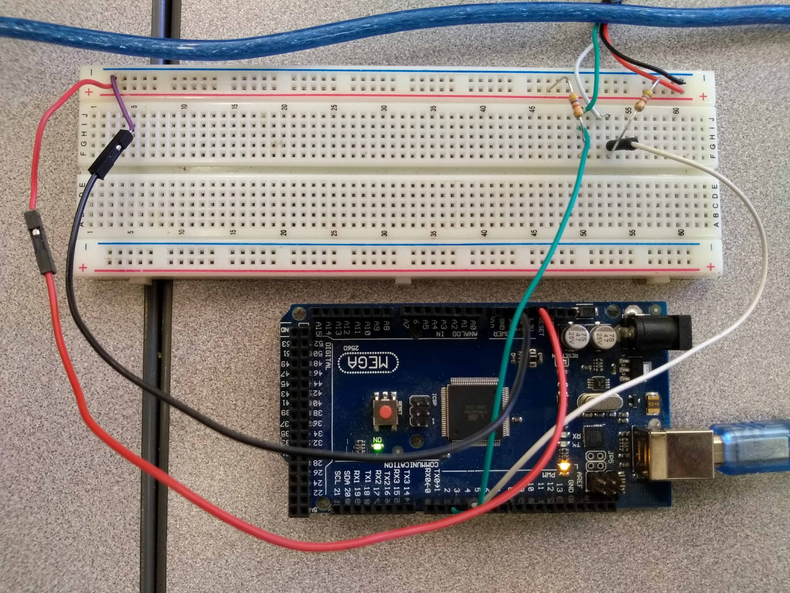

# TrackWalker
This is a repository for all code related to the track walking project.

The following document is meant to be a guide to starting work on this project, please see Evë Maquelin (maquelea@rose-hulman.edu) for more information.

## Goals
The main goal of this project is to generate a RoseLap track file (see TrackGen project for details) from encoder data.

As of 2017-28-11, the plan is to use a wheeled device with two encoders a set distance apart (say, D) and use their differences in angular displacement to determine the curvature of the track at various points. [This file](reference/CurvatureThing.m) has an example of how that will work. From that data we can generate a list of RoseLap compatible track segments which can then be used for analysis.

## Tasks
The following things need to be completed:
- Select encoder library

  You could write your own encoder code like in the example below, but that is prone to issues. Look for multiple encoder support.
- Write data to SD card

  Write the data we get out from an run of the trackwalker to a file. You could make your own file format or just write to a txt or csv.
- Generate RoseLap track file

  Turn the encoder data into a series of segments. See TrackGen project and Timothy Pieschala for details.

The following things have been completed:
- Source Arduino and accessories

  Arduino + SD card shield sourced from Thad's farm (farm fresh electronics woohoo!) and in green box. Also two SD cards and a flash drive, all blue/silver.

## Arduino Setup
As of 2017-28-11, there is an Arduino set up to read the data from a single encoder. It is wired as shown below.

Though perhaps hard to make out, the general idea is that black is ground (GND), and the green and white encoder wires are connected to digital pins 3 and 4. The arduino can be connected to any computer with the [Arduino IDE](https://www.arduino.cc/en/Main/Software) and data can be read through the Serial Monitor (Tools -> Serial Monitor) after uploading [code such as this](https://playground.arduino.cc/Main/RotaryEncoders) to the arduino.
